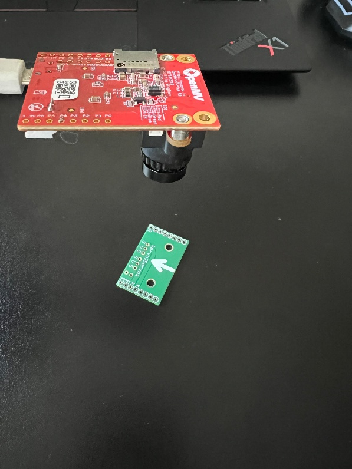
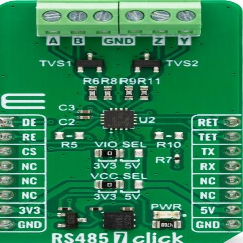
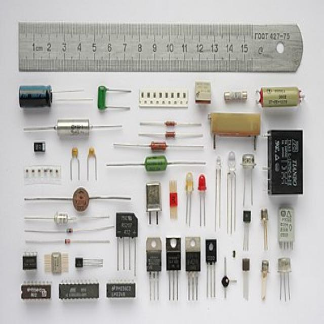
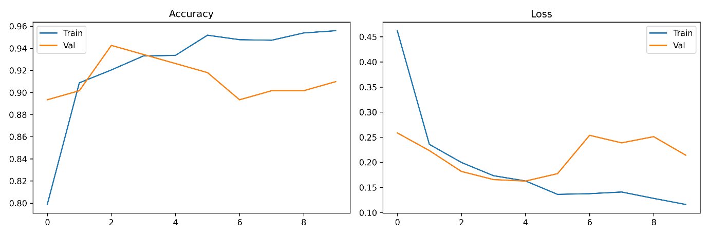

# PCB Image Classifier – Embedded Deployment on OpenMV Cam H7
 
## Introduction
 
This project uses a lightweight convolutional neural network (i.e. MobileNetV2) to classify images as either PCB or not-PCB, and deploys it directly on the OpenMV Cam H7 board. This board contains the ARM Cortex M-7 microcontroller, a 480MHz clock speed, 1MB of internal SRAM and 2MB of flash memory. This readme file contains all the necessary steps to deploy the models onto the board, from dataset collection to edge deployment.
 

 
The classifier outputs its prediction (label + confidence) to the OpenMV serial REPL, making it straightforward to integrate into a larger sorting pipeline.
 
---
 
## Dataset
 
The dataset used for training is a combination of publicly available sources and primary data captured by the author.
 
📎 **[Insert dataset in file format]**
 
| PCB | Not-PCB |
|---|---|
|  |  |
 
Class imbalance is intentionally left. Since the natural size of the 'not-pcb' class is substantially greater than the PCB class (i.e. there are many more ways to describe the absence of a PCB than the presence of one). This reflects what you would expect visually what a sorting system would see.
 
All images are resized to 96×96 pixels during preprocessing. This input size was chosen specifically to reduce runtime memory consumption on the target hardware, compared to the standard 224×224 or 480×480 used in desktop-class deployment.
 
---
 
## Installation - Training Environment (Kaggle)
 
No local installation is required for training. The notebook runs entirely on Kaggle's server GPU environment.
 
**Steps**
 
- Create a free account at [kaggle.com](https://www.kaggle.com)
- Navigate to **Code → New Notebook**
- Upload `notebooks/Vision.py` or import it directly from this repository
- In the notebook settings, enable **GPU accelerator** (P100 or T4)
- Upload your dataset or attach the relevant Kaggle datasets via **Add Data**
- Run all cells top to bottom
> **Note:** The notebook uses TensorFlow 2.x, which is pre-installed in the Kaggle environment. No additional `pip install` steps are required.
 
---
 
## Installation — OpenMV IDE (Deployment)
 
To flash the inference script and communicate with the camera over serial, you need the OpenMV IDE.
 
- Download and install OpenMV IDE from [openmv.io/pages/download](https://openmv.io/pages/download)
- Connect the OpenMV Cam H7 to your computer via USB
- Open OpenMV IDE. The camera should be detected automatically in the bottom-left status bar
- If prompted, allow the IDE to update the camera firmware.
---
 
## Pipeline Walkthrough
 
### Step 1 - Data Preparation
 
The data is split (roughly 70/15/15) into train, validation, and test sets. Data augmentation including flips, rotations and brightness is applied on-the-fly to the training set only. Validation and test datasets have no augmentation applied to them.
 
Pixel values are normalised using ***normalised = (pixel / 127.5) - 1.0***
 
This maps the input range [0, 255] → [-1.0, 1.0], which is the expected input for MobileNet variant models.
 
---
 
### Step 2 - Model Training (Kaggle Notebook)
 
The notebook trains a MobileNetV2 backbone with ImageNet pre-trained weights. A custom classification head is attached for the binary output.
 
**Training configuration:**
 
| Parameter | Value |
|---|---|
| Optimiser | Adam |
| Learning rate | 1 × 10⁻³ |
| Batch size | 32 |
| Max epochs | 30 |
| Early stopping patience | 5 |
| Input size | 96 × 96 × 3 |
| Output | Binary (PCB / not-PCB) |
 
Alpha (width multiplier) variants tested: 0.35, 0.50, 0.75, 1.0. The alpha parameter scales the number of filters in each layer, directly controlling model size and memory footprint.
 

 
---
 
### Step 3 - INT8 Quantisation
 
After training, the Keras model is converted to TensorFlow Lite with INT8 quantization. This reduces the model from 32-bit floating point weight representation to 8-bit integers, significantly shrinking both model size and memory.
 
A **representative dataset** of 100 images (drawn from the training set) is used during quantization to calibrate the activation ranges:
 
```python
def representative_dataset():
    for image_batch, _ in train_dataset.take(100):
        for image in image_batch:
            yield [tf.expand_dims(image, axis=0)]
 
converter = tf.lite.TFLiteConverter.from_keras_model(model)
converter.optimizations = [tf.lite.Optimize.DEFAULT]
converter.representative_dataset = representative_dataset
converter.target_spec.supported_ops = [tf.lite.OpsSet.TFLITE_BUILTINS_INT8]
converter.inference_input_type = tf.int8
converter.inference_output_type = tf.int8
 
tflite_model = converter.convert()
```
 
---
 
### Step 4 - Copying the Model to the OpenMV Cam H7
 
- Connect the OpenMV Cam H7 via USB
- Copy `models/model_int8.tflite` to the camera's filesystem
- Eject the drive safely before proceeding
📸 **[Figure placeholder: Screenshot of OpenMV camera filesystem showing model_int8.tflite in root]**
 
---
 
### Step 5 - Flashing the Inference Script
 
- Open OpenMV IDE
- Open `openmv/classify.py` via **File → Open File**
- Click the **green play button** (▶) in the bottom-left of the IDE to run the script
- The script will begin capturing frames and printing predictions to the **Serial Terminal** panel at the bottom of the IDE
📸 **[Figure placeholder: OpenMV IDE screenshot showing classify.py loaded and serial terminal output]**
 
---
 
## Inference Script (`classify.py`)
 
The MicroPython script loads the quantized model, captures a frame from the camera, and outputs the predicted class label and confidence score to the serial monitor.
 
```python
import sensor, image, time, tf
 
# Initialise camera
sensor.reset()
sensor.set_pixformat(sensor.RGB565)
sensor.set_framesize(sensor.B96X96)   # 96x96 to match training input size
sensor.skip_frames(time=2000)
 
# Load the INT8 TFLite model from the camera filesystem
model = tf.load("/model_int8.tflite", load_to_fb=True)
 
labels = ["not-PCB", "PCB"]
 
clock = time.clock()
 
while True:
    clock.tick()
    img = sensor.snapshot()
 
    # Run inference
    predictions = model.predict([img])[0].output()
 
    # Get top prediction
    predicted_index = predictions.index(max(predictions))
    confidence = max(predictions)
    label = labels[predicted_index]
 
    print(f"Prediction: {label} | Confidence: {confidence:.2f} | FPS: {clock.fps():.1f}")
```
 
**Output example (Serial Terminal):**
 
```
Prediction: PCB | Confidence: 0.94 | FPS: 8.3
Prediction: not-PCB | Confidence: 0.87 | FPS: 8.1
```
 
---
 
## References
 
- Howard, A. G., et al. (2017). *MobileNets: Efficient Convolutional Neural Networks for Mobile Vision Applications*. arXiv:1704.04861.
- Sandler, M., et al. (2018). *MobileNetV2: Inverted Residuals and Linear Bottlenecks*. CVPR 2018.
- David, R., et al. (2021). *TensorFlow Lite Micro: Embedded Machine Learning on TinyML Systems*. MLSys 2021.
---
 
## Licence
 
This repository is made publicly available for academic inspection as part of a 3rd Year Individual Project submission at the University of Manchester, Department of Electrical and Electronic Engineering, 2025/26.
